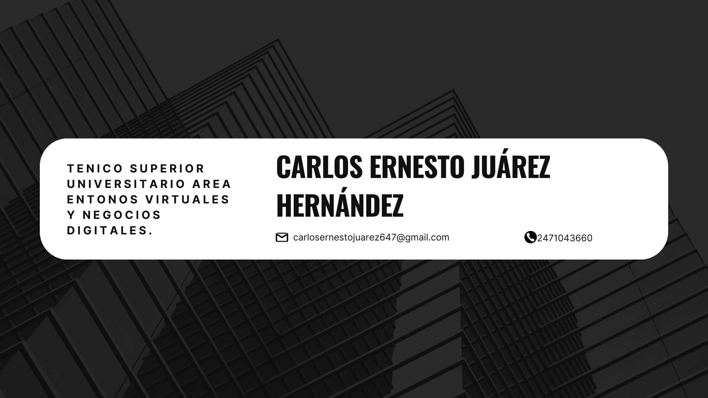

# Carlos Ernesto Juárez Hernández

### Contacto
- 📍 San Sebastián, calle Fernando Montes de Oca, Huamantla, Tlaxcala
- 📧 carlosernestojuarez647@gmail.com
- 📱 +52 247 104 3660
- [X](https://x.com/NeztoGGz?t=tvG4_27QTH0-YHDe5krv5w&s=09) | [Indeed](https://profile.indeed.com/?hl=es_MX&co=MX&from=gnav-homepage)
- [Curriculum_PDF](Currículum_JuarezCarlos.pdf)

---
## 🙋‍♂️ Quien Soy
Soy una persona con experiencia en análisis de datos y machine learning, con un enfoque en la mejora de procesos mediante el uso de herramientas avanzadas y metodologías ágiles. He trabajado en proyectos que involucran el desarrollo de soluciones de software, desde aplicaciones web hasta plataformas interactivas, con un dominio de herramientas como Google Colab, Unity 3D, Flutter y Firebase. Poseo sólidos conocimientos en el diseño y desarrollo de interfaces de usuario, además de tener una gran capacidad para resolver problemas mediante la implementación de modelos de machine learning.

Actualmente, me encuentro desarrollando un proyecto propio llamado GONORT TECH, una plataforma de comercio electrónico y servicios relacionados con accesorios y reparaciones de celulares, donde utilizo mis habilidades tanto en desarrollo web como en optimización de bases de datos y autentificación de usuarios a través de Firebase

---

## 👨‍💻 Experiencia Profesional

*Desarrollador Web para negocio*  
EL BOTANERO Huamantla (Abril-Agosto 2022)
- Desarrollo de aplicaciones web usando frameworks modernos.
- Integración y funcionalidades de bases de datos (MYSQL).

*Desarrollador para aplicación de realidad aumentada"*  
AGAPSA Cuapiaxtla (Mayo-Agosto 2023)
- Desarrollo de aplicación de realidad aumentada usando Unity 3D.
- Integración de herramientas actuales para AR (AR Fundation).
- Integración de modelado 3D.
- Diseño y tratado de imagenes.
- *Tecnologías*: Unity 3D, Blender, Illustrator, Photoshop.

*Fundador y Desarrollador Principal*  
GONORT TECH (Mayo 2024 - Presente)
- Creación de una plataforma para la venta de accesorios y agendamiento de reparaciones de celulares.
- Gestión de la infraestructura web con enfoque en la experiencia de usuario.
- *Tecnologías*: Flutter, Firebase.

---

## 💻 Habilidades Técnicas
- *Lenguajes*: Python, JavaScript, Dart, HTML, CSS, JavaScript.
- *Frameworks*: Flutter, React.
- *Herramientas*: Firebase, MYSQL, Mongo DB, Google Colab, Git, GitHub.
- *Diseño*: Figma, Photoshop, Illustrator, Adobe Premier.

---

## 🦾 Competencias Interpersonales
- Comunicación efectiva
- Trabajo en equipo
- Empatía
- Resolución de conflictos
- Adaptabilidad
- Proactividad
- Creatividad
- Colaboración
- Liderazgo
  
---

## 📚 Educación
*Ingeniería en Entrnos Vituales y Negocios Digitales*  
Universidad Tecnológica de Tlaxcala (2021 - 2025)

*Tecnico en Entrnos Vituales y Negocios Digitales*  
Universidad Tecnológica de Tlaxcala (2021 - 2024)

*Tecnico en Programación*  
CBTis #061 (2018 - 2021)

---

## 🌐 Idiomas
- Español: Nativo
- Inglés: A2

---

